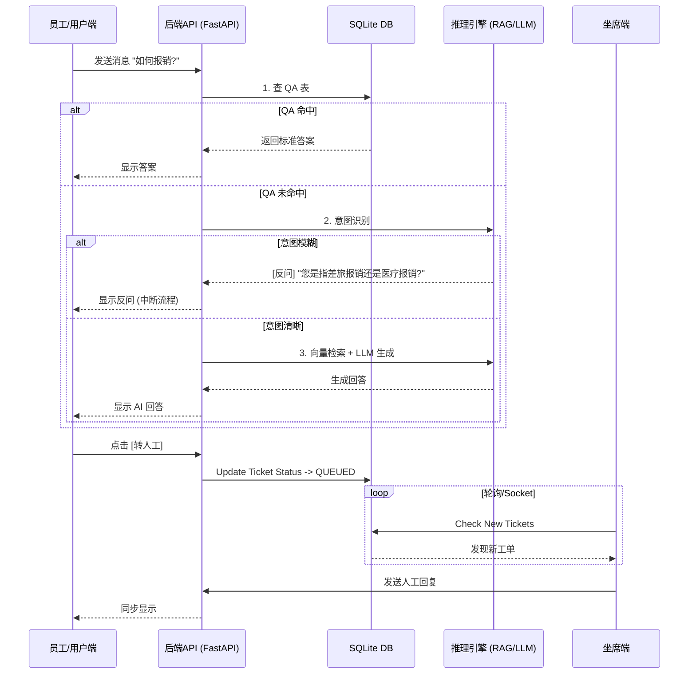

# 智能客服系统 (AI Customer Service System) - 产品需求文档 (PRD)

> **文档状态**: ✅ 已锁定 (Locked)  
> **版本**: V1.0 (MVP)  
> **日期**: 2026-02-11  
> **设计理念**: 方案 B - 专业工作台 (Pro Dashboard)

---

## 1. 产品战略规划 (Product Strategy)

### 1.1 核心目标 (Mission)
打造一个**无缝融合AI智能与人工温情的高效客服协同平台**。让简单问题通过三级推理引擎秒级解决，复杂问题无缝流转至人工坐席，并通过人机协作由AI辅助快速处理，同时实现知识资产的自动沉淀与更新。

### 1.2 用户画像 (Persona)
| 角色 | 核心痛点 | 产品价值 |
| :--- | :--- | :--- |
| **咨询发起者 (用户/员工)** | 讨厌排队，讨厌“人工智障”式的死循环回答，希望直接解决问题。 | 提供秒级响应；智能意图识别避免无效沟通；一键转人工无缝衔接。 |
| **智能坐席 (Agent)** | 缺乏用户上下文，多系统切换繁琐，回复效率低。 | **单屏工作台**；提供历史对话上下文；**AI Copilot** 自动生成建议回复；一键检索知识库。 |
| **质检/管理员** | 复盘繁琐，知识库更新不及时，难以量化服务质量。 | 结构化工单归档；甚至在聊天中即可标注数据；自动化的 QA/向量 知识库构建。 |

---

## 2. 产品路线图 (Roadmap)

### 2.1 V1: 最小可行产品 (MVP) —— "核心闭环"
本阶段目标：**跑通全流程数据流，实现单机/局域网内的完整演示**。

#### 通用模块/底层
-   [x] **统一登录网关**：支持 `admin/123456` 校验，进入后可切换视图（调试模式）。
-   [x] **SQLite 数据中心**：集成 QA库、向量库、业务数据（工单/消息）。
-   [x] **LLM 接口服务**：集成大模型 API，支持流式输出。

#### 界面 2：员工/用户端 (User Terminal)
-   [x] **历史会话侧边栏**：显示过往工单，区分“已完成”与“进行中”。
-   [x] **智能三级推理引擎**：
    1.  **精确 QA 匹配**：优先检索 QA 库。
    2.  **意图模糊检测**：模型分析 Query，若模糊则触发追问。
    3.  **RAG 向量检索**：基于语义检索文档片段 -> LLM 生成回复。
-   [x] **转人工触发器**：用户点击后，工单状态变更，进入坐席队列。
-   [x] **实时同步**：能够实时看到坐席的回复内容。

#### 界面 3：坐席端 (Agent Terminal)
-   [x] **高密度工作台 (Dashboard)**：左侧工单列表（待办/进行中/已解决），中间对话窗口，右侧辅助信息。
-   [x] **实时交互**：接手“转人工”工单，发送消息同步给用户。
-   [x] **AI Copilot (智能辅助)**：一键根据上下文 + 向量库检索生成建议回复。
-   [x] **工单完结**：点击“完结”归档工单，用户端变为不可回复状态。

#### 界面 4：质检端 (QA Audit)
-   [x] **归档查询**：仅展示已完结 (`Resolved`) 的工单。
-   [x] **评分系统**：对工单服务质量进行评分（1-5星及评语）并入库。

#### 界面 5：知识库/DB端 (Knowledge Base)
-   [x] **Markdown 上传**：支持 `.md` 文件上传。
-   [x] **双流处理管道**：
    1.  **Slicing -> Embedding -> Vector DB** (用于 RAG)。
    2.  **Slicing -> LLM QA Gen -> QA DB** (用于精确问答)。

### 2.2 V2+ 未来规划 (Future)
-   **RBAC 权限系统**：严格分离用户、坐席、管理员登录入口。
-   **WebSocket 推送**：替代轮询，支持“对方正在输入...”状态。
-   **数据大屏**：可视化展示转人工率、响应时间等 KPI。
-   **多模态支持**：支持图片发送与解析。

---

## 3. 核心业务逻辑与数据契约

### 3.1 业务规则 (Business Rules)
1.  **工单状态机 (Ticket Lifecycle)**:
    -   `PENDING_AI` (默认): 用户仅与 AI 对话中。**坐席不可见**。
    -   `QUEUED_HUMAN`: 用户点击“转人工”。**进入坐席“待处理”列表**。
    -   `IN_PROGRESS`: 坐席选中工单开始回复。
    -   `RESOLVED`: 坐席点击“完结”。**双方不可再发送消息，进入质检列表**。
    -   `RATED`: 质检完成评分。

2.  **检索优先级策略**:
    ```mermaid
    graph LR
    A[用户Query] --> B{QA库命中?};
    B -- Yes --> C[返回标准QA答案];
    B -- No --> D{模型判断意图模糊?};
    D -- Yes --> E[返回引导性反问];
    D -- No --> F[向量检索 Top-K];
    F --> G[LLM 生成 RAG 回复];
    ```

### 3.2 数据契约 (Data Contract - Simplified Scheme)

所有数据存储于 `sqlite.db`。

*   **Tickets (工单表)**
    *   `id`: INTEGER PK
    *   `user_id`: STRING
    *   `status`: STRING (pending_ai, queued, in_progress, resolved, rated)
    *   `summary`: TEXT (自动生成的摘要)
    *   `created_at`: DATETIME
    *   `score`: INTEGER (质检评分)

*   **Messages (消息表)**
    *   `id`: INTEGER PK
    *   `ticket_id`: INTEGER FK
    *   `sender`: STRING (user, ai, agent)
    *   `content`: TEXT
    *   `created_at`: DATETIME

*   **Knowledge_QA (QA库)**
    *   `id`: INTEGER PK
    *   `question`: TEXT
    *   `answer`: TEXT (标准回复)
    *   `source`: STRING (来源文件名)

*   **Knowledge_Vector (向量库)**
    *   `id`: INTEGER PK
    *   `content`: TEXT (切片文本)
    *   `embedding`: BLOB (序列化的向量数组)
    *   `source`: STRING

---

## 4. MVP 原型设计 (Prototype Design)

### 选中方案：B (专业工作台 Pro Dashboard)
**设计风格**：SaaS 效率优先，三栏布局，信息高密度。

```text
+-----------------------------------------------------------------------+
|  [Logo] 智能客服系统   |  🔴 待处理(3)  |  🟢 服务中(1) |  👤 admin   |
+-----------------------+-----------------------------------------------+
|  NAV:                 |                                               |
|  [1] 💬 客服工作台    |            当前工单: #1024 咨询退款           |
|  [2] ✅ 质检中心      |  -------------------------------------------  |
|  [3] 📚 知识库管理    |  [10:00] User: 你好，我想问下退款进度？       |
|                       |  [10:00] AI:   正在查询，通常3天内到账。      |
|  -------------------  |  [10:01] User: 但是我已经等了5天了！          |
|  [10:01] User: 转人工！我要投诉！             |
|                       |  ----------------------- SYSTEM: 转接中 ----- |
|  [🔴] #1025 投诉...   |  [10:02] Agent: 您好，我是工号9527...         |
|       "很生气..."     |                                               |
|                       |                                               |
|  [🟢] #1024 退款...   |                                               |
|       "进度查询"      |                                               |
|                       |                                               |
|  [⚪] #1023 已完结    |  -------------------------------------------  |
|                       |  [ 输入回复...                         ] [⬆]  |
|                       |  工具栏: [📄 快捷语] [🤖 AI生成建议] [🔚 完结]|
|                       |                                               |
+-----------------------+-----------------------------------------------+
|                       |  >> 右侧辅助栏 (Context & Copilot)            |
|                       |  [🧠 意图分析]: 用户情绪激动，涉及投诉        |
|                       |  [🔍 推荐知识]:                               |
|                       |     1. 《退款延迟处理SOP》 (匹配度 92%)       |
|                       |     2. 《安抚话术-通用篇》                    |
|                       |  -------------------------------------------  |
|                       |  [💡 AI 建议回复]:                            |
|                       |  "非常抱歉让您久等了。既然已经超过时限，我    |
|                       |   这就帮您升级给财务专员加急处理..."          |
|                       |  [ 采纳并发送 ]                               |
+-----------------------+-----------------------------------------------+
```

---

## 5. 架构设计蓝图 (Architecture Blueprint)

### 5.1 核心流程图 (Sequential Flow)



### 5.2 组件交互与技术栈
*   **前端 (Frontend)**: `React 18` + `Vite` + `TailwindCSS`
    *   **理由**: 快速构建响应式 Dashboard，Tailwind 非常适合实现复杂的栅格布局 (Layout B)。
    *   `GlobalState`: 使用 React Context 或 Zustand 管理当前选中的工单 ID。

*   **后端 (Backend)**: `Python` + `FastAPI`
    *   **理由**: Python 是 AI/LLM 开发的首选。FastAPI 性能高且开发极快。
    *   `Vector Engine`: 使用 `numpy` (内存计算余弦相似度) 或 `chromadb` (本地向量库)。鉴于 MVP 规模，**Numpy + SQLite Blob** 方案最轻量可靠。

*   **文件/目录结构规划**:
    ```
    /project_root
      ├── backend/
      │   ├── main.py            # API 入口
      │   ├── models.py          # Pydantic 模型 & DB Schema
      │   ├── rag_service.py     # 核心三级推理逻辑
      │   ├── database.py        # SQLite 连接与 CRUD
      │   └── utils.py           # 向量计算工具
      ├── frontend/
      │   ├── src/
      │   │   ├── components/    # ChatWindow, TicketList, Layout
      │   │   ├── pages/         # Login, AgentDashboard, UserChat
      │   │   └── api/           # Axios 封装
      ├── data/                  # 存储上传的 .md 文件
      └── customer_service.db    # SQLite 文件
    ```

### 5.3 风险预判
1.  **大模型延迟**: 三级推理链较长，如果不做流式输出 (Streaming)，用户等待感会很强。
    *   *对策*: 后端 API 必须支持 SSE (Server-Sent Events) 流式返回。
2.  **并发冲突**: 多个坐席同时抢单。
    *   *对策*: MVP 阶段不需复杂锁，但需在前端做状态检查（"该工单已被其他坐席锁定"）。
